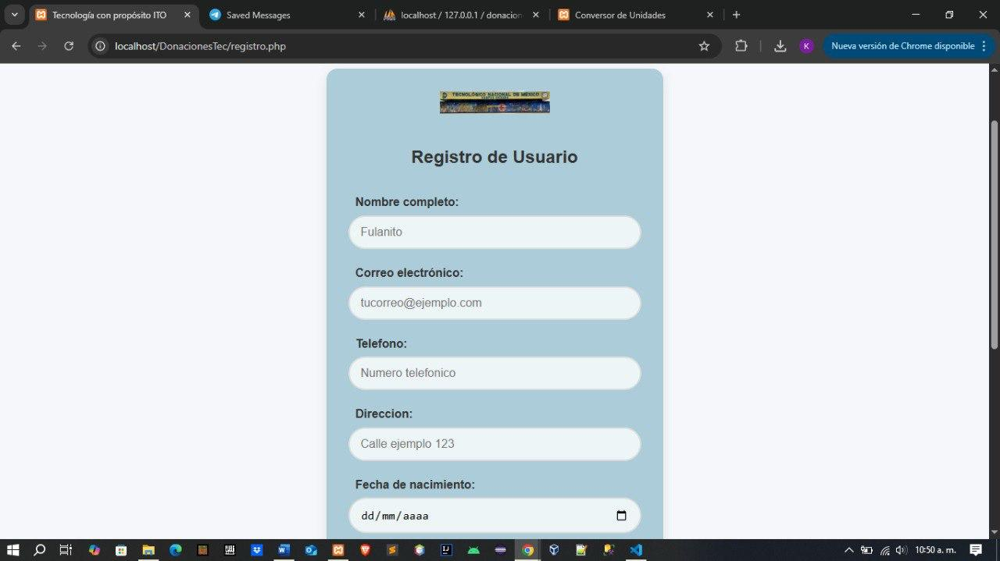
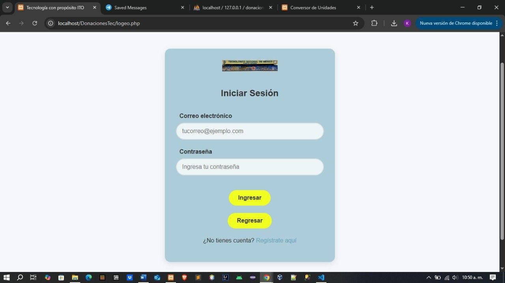
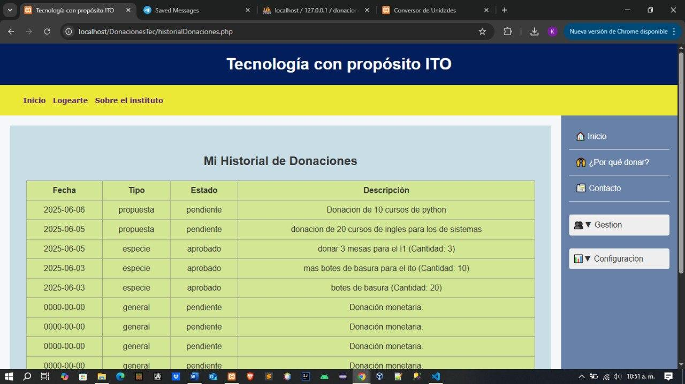
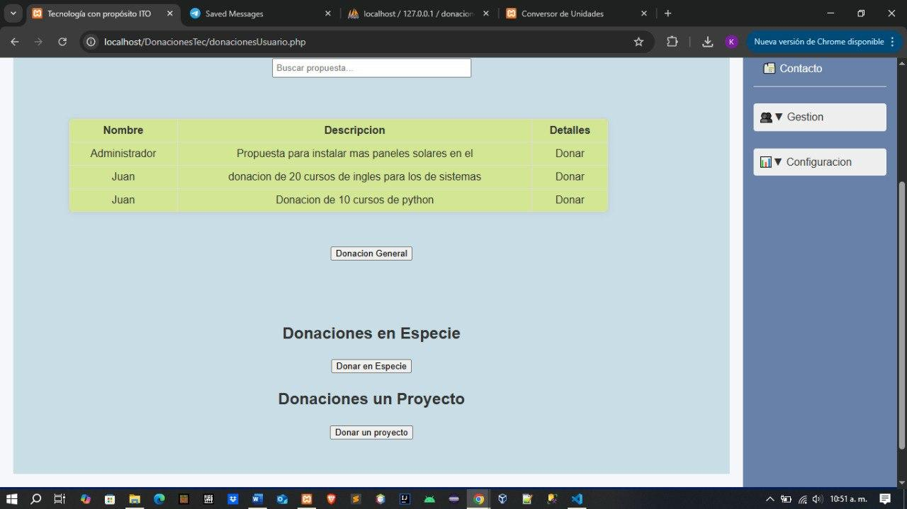
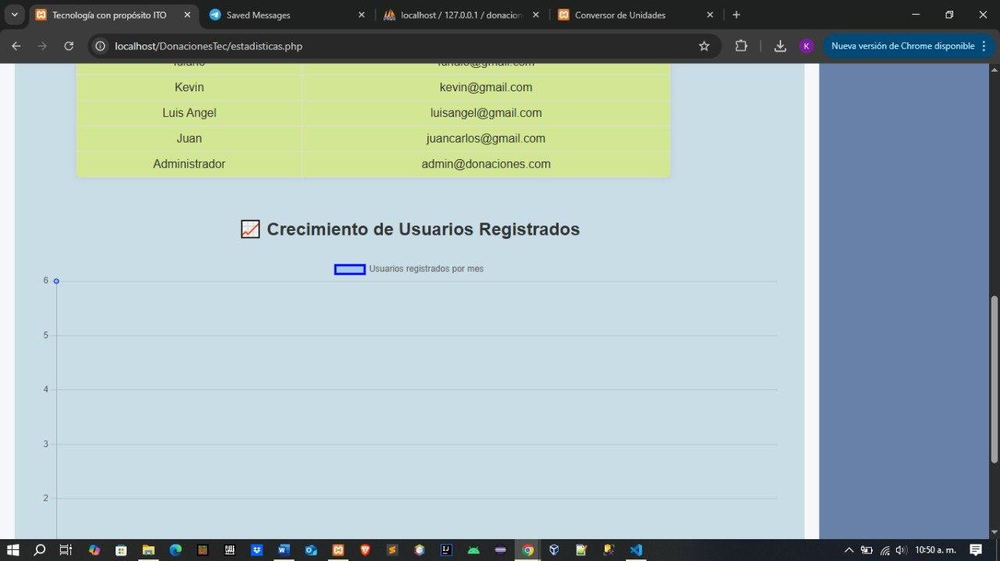

# 📚 Sistema de Gestión de Donaciones - ITO

## 📝 Descripción del proyecto

El sistema permite funcionalidades específicas para dos tipos de usuarios:

### Funciones del Administrador:
- Registrar, modificar, consultar y eliminar donantes.
- Registrar, modificar, consultar y eliminar donaciones (monetarias, en especie o a proyectos).
- Generar comprobantes en PDF por cada donación.
- Visualizar estadísticas generales mediante gráfica.
- Gestionar usuarios con diferentes roles y permisos.
- Consultar el ranking o top de donantes por tipo de donación.

### Funciones del Donante:
- Crear su propia cuenta o ser registrado por el administrador.
- Realizar donaciones monetarias, en especie o a proyectos específicos.
- Consultar su historial personal de donaciones.
- Visualizar estadísticas relacionadas con sus donaciones.
- Consultar el ranking o top de donantes.

---

## 🛠️ Instalación y ejecución

### Requisitos:
- XAMPP (o cualquier servidor local con soporte PHP y MySQL)
- Navegador web moderno (Chrome, Firefox, Edge, etc.)
- phpMyAdmin (incluido en XAMPP)

---

### Forma 1: Usando archivo comprimido `.zip`

1. Descarga el archivo comprimido `DonacionesTec.zip`.
2. Descomprime el archivo.
3. Copia la carpeta descomprimida **completa** dentro del directorio `C:\xampp\htdocs\`.
4. Abre el panel de control de XAMPP y ejecuta los servicios **Apache** y **MySQL**.
5. Abre tu navegador y ve a `http://localhost/phpmyadmin`.
6. Crea una base de datos llamada `donaciones_ito`.
7. Importa el archivo `bd_donaciones.sql` ubicado dentro de la carpeta del proyecto para crear las tablas necesarias.
8. Abre el archivo `AccesoDatos.php` y configura los datos de conexión a la base de datos (usuario, contraseña, puerto) según tu configuración local.
9. Navega a `http://localhost/DonacionesTec` para acceder al sistema.

---

### Forma 2: Copiar archivos manualmente

1. Descarga cada archivo que se encuentra en el repositorio
2. Abre el directorio `C:\xampp\htdocs\` y crea una nueva carpeta llamada `DonacionesTec` (o el nombre que prefieras).
3. Copia **todos los archivos y carpetas** que descragaste dentro de esta carpeta `DonacionesTec`.
4. Inicia los servicios **Apache** y **MySQL** desde el panel de control de XAMPP.
5. Abre el navegador y accede a `http://localhost/phpmyadmin`.
6. Crea una base de datos llamada `donaciones_ito`.
7. Importa el archivo `bd_donaciones.sql`.
8. Configura la conexión a la base de datos editando el archivo `AccesoDatos.php` con tus datos locales.
9. Finalmente, accede a `http://localhost/DonacionesTec` para usar el sistema.

---

¡Listo! Ahora el sistema está preparado para ser utilizado.

## 🖼️ Capturas de pantalla iniciales

---

## 🎓 Datos académicos

**TECNOLÓGICO NACIONAL DE MÉXICO**  
**Instituto Tecnológico de Orizaba**

👥 **Equipo de alumnos:**  
- García Landa Diana  
- Gonzales Morgado Kevin Jose  
- Ramirez Covarrubias Jose Manuel  
- Hernadez Cardozo Emmanuel  

👩‍🏫 **Docente:** Patricia Quitl González  
📘 **Materia:** 6G5D Programación Web  
📂 **Proyecto:** "CRUD Contactos"  

🗓️ **Periodo:** Enero - Junio 2025  
